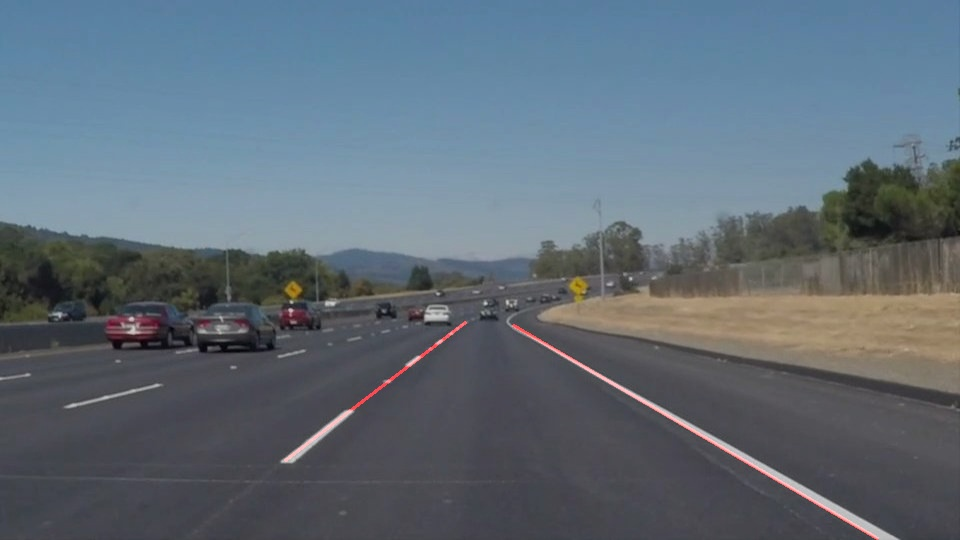

# **Finding Lane Lines on the Road** 

---

**Finding Lane Lines on the Road**

The goals / steps of this project are the following:
* Make a pipeline that finds lane lines on the road
* Reflect on your work in a written report

---

### Reflection

### 1. Describe your pipeline. As part of the description, explain how you modified the draw_lines() function.

* My pipeline follows the following steps:
* Grayscale conversion
* Canny transform
* Masking - region of interest
* Hough transform

For extrapolation, I implemented the draw_lines() function by 
* classify line segments into two groups - those belongs to left lane, and right lane
* computing the averaged slopes and the averaged center points for left and right lanes
* finding the two ending points (top point and low point) from line segments belonging left and right lanes
* Using one coordinate (either x or y) from the ending points, averaged slope and averaged center point, to derive the other coordinate (y or x, correspondingly)
* Plot the left and right lanes by connecting the two ending points with adjusted coordinates 

Here are two examples of the output:
* With solid white lanes

* With solid yellow lanes

### 2. Identify potential shortcomings with your current pipeline

One potential shortcoming would be that the region of interest is hardcoded however the road geometry varies and this region of interest filter may not be optimized for such situations.

Another shortcoming could be that for roads with larger curvatures, the straight line model may not work well.

### 3. Suggest possible improvements to your pipeline

I am not sure how to do a dynamic region of interest. Hope to get some ideas in later course materials.

For curvy roads, I think a polynomial-based model can work better as it provides more accurate representation of the lanes.
